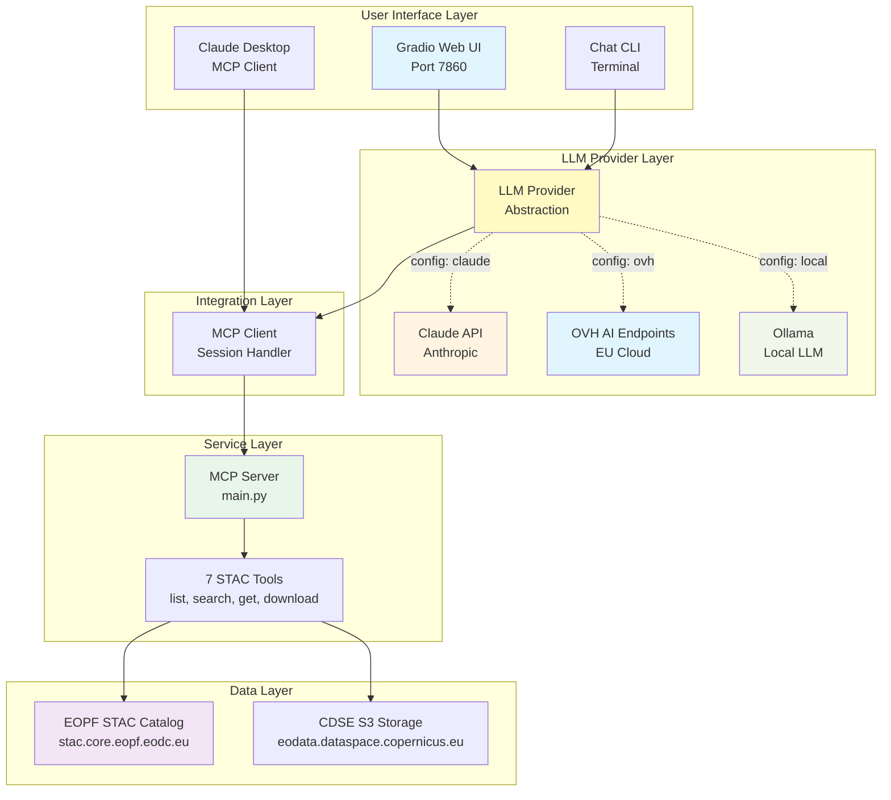
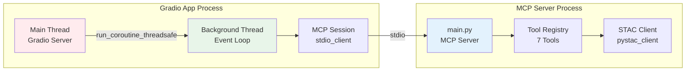
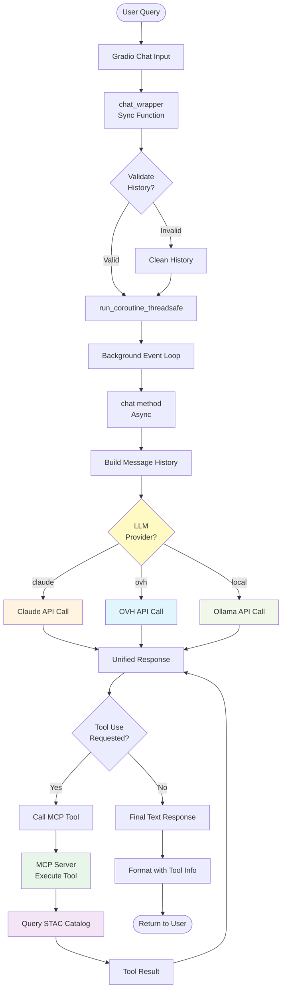
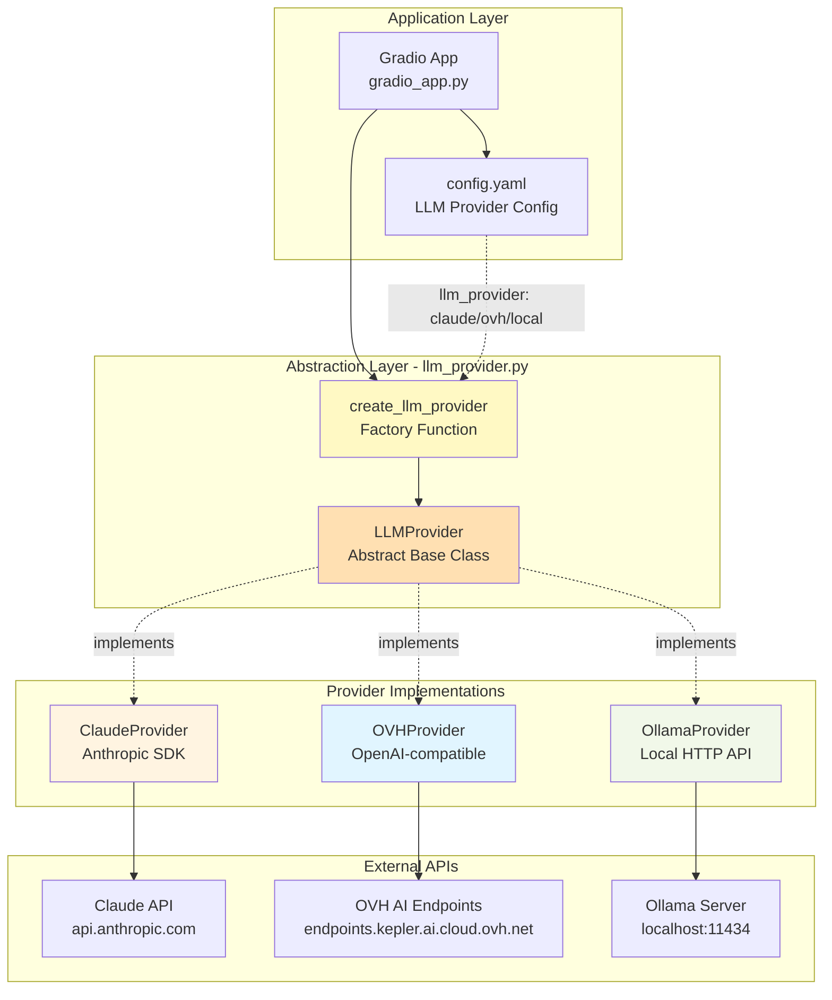
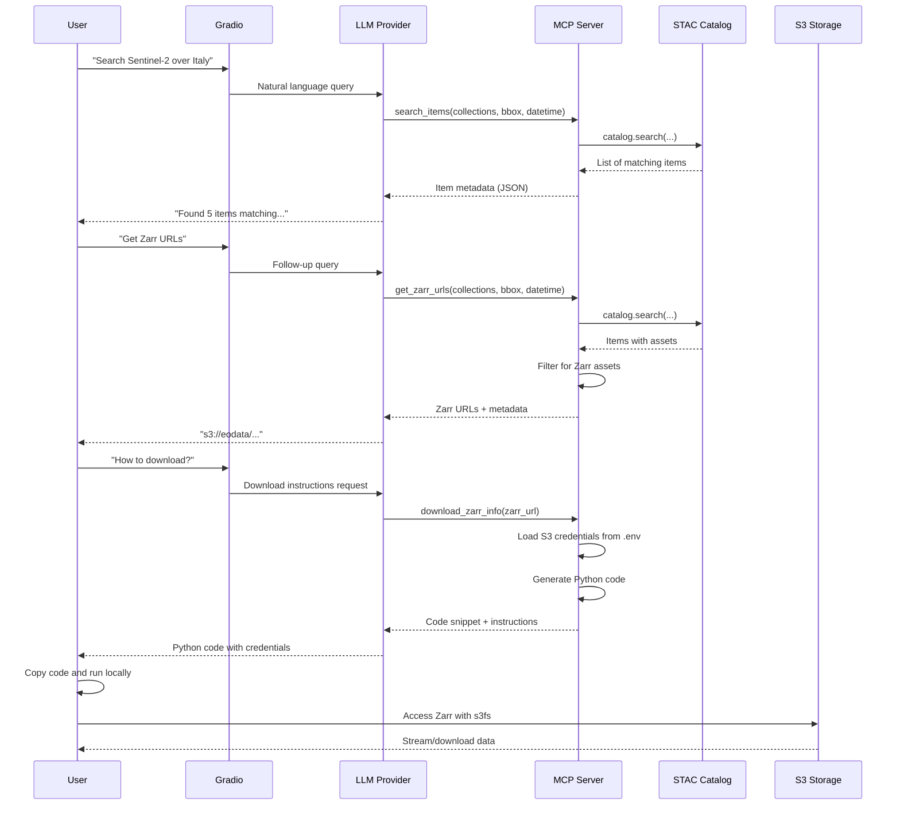
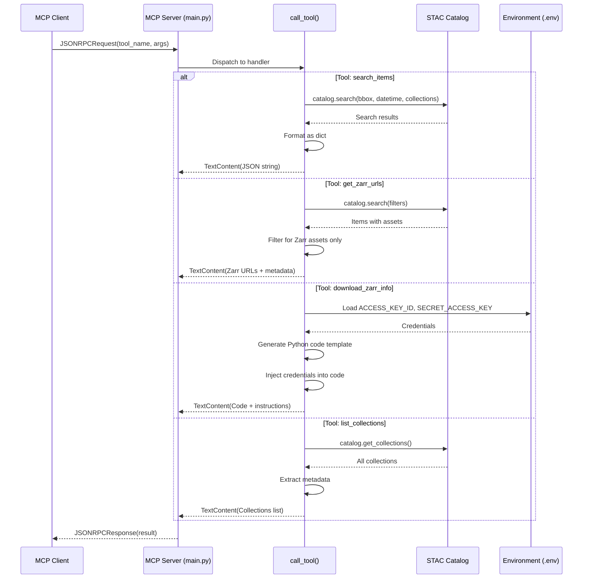
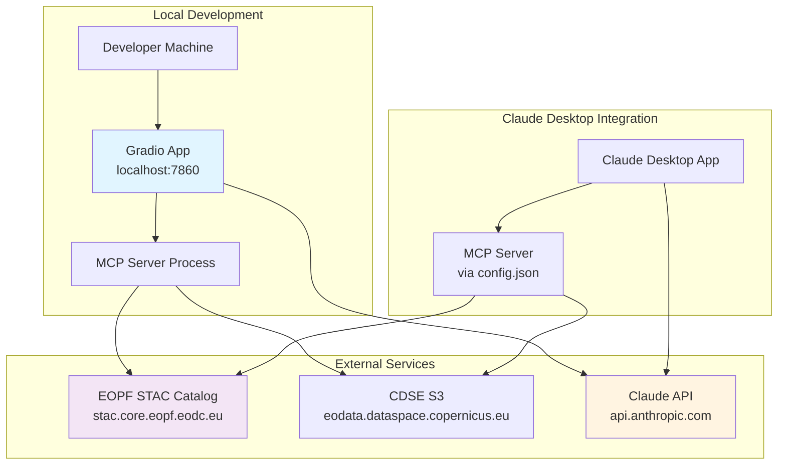
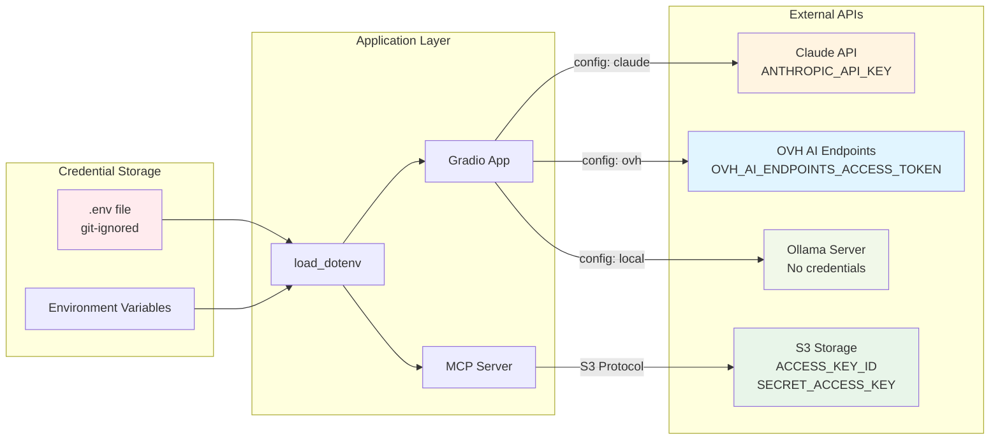

# System Architecture and Sequence Diagrams

## System Architecture

### High-Level Architecture



### Detailed Component Architecture



### Data Flow Architecture



### LLM Provider Abstraction Architecture



**LLM Provider Interface:**
```python
class LLMProvider(ABC):
    @abstractmethod
    async def create_message(messages, tools=None) -> Response

    @abstractmethod
    def format_tool_response(response) -> (tool_uses, text)
```

**Configuration-Based Selection:**
- `llm_provider: "claude"` → ClaudeProvider (Anthropic API)
- `llm_provider: "ovh"` → OVHProvider (OVH AI Endpoints)
- `llm_provider: "local"` → OllamaProvider (Local Ollama)

**Model Options:**
- **Claude**: opus-4-6, sonnet-4-5, haiku-4
- **OVH**: Llama-3.1-8B-Instruct, Mistral-7B-Instruct-v0.3
- **Ollama**: qwen3.5:35b, llama3.1, mistral, etc.

## Sequence Diagrams

### 1. Gradio App Initialization

```mermaid
sequenceDiagram
    participant User
    participant Main as main()
    participant App as STACGradioApp
    participant Thread as Background Thread
    participant Loop as Event Loop
    participant MCP as MCP Server Process

    User->>Main: uv run python gradio_app.py
    Main->>Main: Load config.yaml
    Main->>Main: Load .env (API keys)
    Main->>Main: create_llm_provider()
    Note over Main: Selects Claude/OVH/Ollama<br/>based on config
    Main->>App: Initialize STACGradioApp
    Main->>Thread: Start background thread
    Thread->>Loop: Create new event loop
    Loop->>Loop: loop.run_forever()

    Main->>Loop: run_coroutine_threadsafe(setup_mcp)
    Loop->>MCP: Start MCP server subprocess
    MCP->>MCP: Initialize STAC connection
    MCP-->>Loop: Connection established
    Loop->>App: Store mcp_session & tools

    Main->>Main: Create Gradio interface
    Main->>User: Launch web UI (port 7860)

    Note over User,MCP: System ready for queries
```

### 2. User Query Flow (with Tool Use)

```mermaid
sequenceDiagram
    participant User
    participant Gradio as Gradio UI
    participant Wrapper as chat_wrapper
    participant Loop as Event Loop
    participant Chat as chat() method
    participant Provider as LLM Provider
    participant LLM as LLM API<br/>(Claude/OVH/Ollama)
    participant MCP as MCP Server
    participant STAC as STAC Catalog

    User->>Gradio: "Get Zarr URLs for Sentinel-2..."
    Gradio->>Wrapper: chat_wrapper(message, history)
    Wrapper->>Wrapper: Validate history format

    Wrapper->>Loop: run_coroutine_threadsafe(chat)
    Loop->>Chat: Execute async chat()
    Chat->>Chat: Build message history

    Chat->>Provider: create_message(messages, tools)
    Provider->>LLM: API call with tools
    LLM-->>Provider: Response with tool_use
    Provider-->>Chat: Formatted response

    Chat->>Chat: Extract tool_use blocks
    loop For each tool
        Chat->>MCP: call_tool("get_zarr_urls", args)
        MCP->>STAC: Search catalog with filters
        STAC-->>MCP: Items with Zarr assets
        MCP->>MCP: Filter Zarr URLs
        MCP-->>Chat: Tool result
    end

    Chat->>Chat: Append tool results to messages
    Chat->>Provider: create_message(with tool results)
    Provider->>LLM: API call with results
    LLM-->>Provider: Final text response
    Provider-->>Chat: Formatted response

    Chat-->>Loop: Return formatted response
    Loop-->>Wrapper: Response ready
    Wrapper-->>Gradio: Display response
    Gradio-->>User: Show results with tool info
```

### 3. STAC Search and Download Flow



### 4. MCP Tool Execution Detail



### 5. Async Event Loop Management

```mermaid
sequenceDiagram
    participant Main as Main Thread
    participant BG as Background Thread
    participant Loop as Event Loop
    participant MCP as MCP Session
    participant Server as MCP Server Process

    Note over Main,Server: Initialization Phase
    Main->>BG: Start thread (daemon=True)
    BG->>Loop: asyncio.new_event_loop()
    BG->>Loop: set_event_loop(loop)
    BG->>Loop: loop.run_forever()

    Note over Loop: Loop now running forever

    Main->>Loop: run_coroutine_threadsafe(setup_mcp)
    Loop->>Server: Start subprocess (uv run main.py)
    Loop->>MCP: stdio_client() context enter
    Loop->>MCP: ClientSession() context enter
    MCP->>Server: Initialize connection
    Server-->>MCP: Ready
    Loop->>MCP: list_tools()
    MCP-->>Loop: 7 tools available
    Loop->>Loop: await asyncio.Event().wait()

    Note over Loop,MCP: Session kept alive indefinitely

    Note over Main,Server: Request Phase
    Main->>Loop: run_coroutine_threadsafe(chat)
    Loop->>MCP: call_tool()
    MCP->>Server: Tool request
    Server-->>MCP: Tool result
    MCP-->>Loop: Result
    Loop-->>Main: future.result()

    Note over Main: Response returned to Gradio
```

### 6. Error Handling Flow

```mermaid
sequenceDiagram
    participant User
    participant Wrapper as chat_wrapper
    participant Loop as Event Loop
    participant Chat as chat()
    participant Claude as Claude API
    participant MCP as MCP Server

    User->>Wrapper: Send message

    alt Invalid History Format
        Wrapper->>Wrapper: Validate history
        Wrapper->>Wrapper: Clean invalid entries
        Note over Wrapper: Prevents "too many values to unpack"
    end

    Wrapper->>Loop: run_coroutine_threadsafe

    alt Timeout
        Loop-->>Wrapper: TimeoutError (120s)
        Wrapper-->>User: "Request timed out..."
    end

    alt Claude API Error
        Loop->>Claude: messages.create()
        Claude-->>Loop: APIError
        Loop->>Chat: Exception
        Chat->>Chat: print(traceback)
        Chat-->>Loop: Error message
        Loop-->>Wrapper: Error string
        Wrapper-->>User: "❌ Error: ... Please rephrase..."
    end

    alt MCP Connection Lost
        Loop->>MCP: call_tool()
        MCP-->>Loop: BrokenResourceError
        Loop->>Chat: Exception
        Chat-->>Wrapper: Error message
        Wrapper-->>User: "❌ Error: ... try refreshing"
    end

    alt Success
        Loop->>Claude: API call
        Claude-->>Loop: Success response
        Loop-->>Wrapper: Result
        Wrapper-->>User: Display response
    end
```

## Component Details

### MCP Server Tools

| Tool Name | Input | Output | STAC Operation |
|-----------|-------|--------|----------------|
| `list_collections` | None | List of collections | `catalog.get_collections()` |
| `get_collection` | collection_id | Collection metadata | `catalog.get_collection(id)` |
| `search_items` | bbox, datetime, collections, query | Items matching filters | `catalog.search(...)` |
| `get_item` | collection_id, item_id | Full item metadata | `collection.get_item(id)` |
| `get_item_assets` | collection_id, item_id | Asset URLs and types | `item.assets` |
| `get_zarr_urls` | bbox, datetime, collections | Filtered Zarr URLs | `catalog.search()` + filter |
| `download_zarr_info` | zarr_url | Python code + credentials | Load from .env |

### Async Architecture Pattern

```
┌─────────────────────────────────────┐
│         Main Thread (Sync)          │
│  ┌──────────────────────────────┐  │
│  │      Gradio Server           │  │
│  │  - HTTP requests             │  │
│  │  - Chat UI rendering         │  │
│  └────────────┬─────────────────┘  │
│               │                     │
│        chat_wrapper(sync)           │
│               │                     │
│               │ run_coroutine_      │
│               │   threadsafe()      │
└───────────────┼─────────────────────┘
                │
                ▼
┌─────────────────────────────────────┐
│    Background Thread (Async)        │
│  ┌──────────────────────────────┐  │
│  │     Event Loop               │  │
│  │  - Runs forever              │  │
│  │  - Handles MCP async ops     │  │
│  └────────────┬─────────────────┘  │
│               │                     │
│        chat() async method          │
│               │                     │
│  ┌────────────▼─────────────────┐  │
│  │    MCP Session (Async)       │  │
│  │  - stdio_client context      │  │
│  │  - ClientSession context     │  │
│  │  - Kept alive with Event()   │  │
│  └────────────┬─────────────────┘  │
└───────────────┼─────────────────────┘
                │ stdio
                ▼
┌─────────────────────────────────────┐
│    MCP Server Process (Subprocess)  │
│  ┌──────────────────────────────┐  │
│  │      main.py                 │  │
│  │  - Stdio communication       │  │
│  │  - Tool execution            │  │
│  │  - STAC queries              │  │
│  └──────────────────────────────┘  │
└─────────────────────────────────────┘
```

## Deployment Architecture



## Security Architecture



## LLM Provider Comparison

| Feature | Claude API | OVH AI Endpoints | Ollama (Local) |
|---------|-----------|------------------|----------------|
| **Quality** | Excellent | Good | Good |
| **Speed** | Fast | Fast | Medium (CPU-dependent) |
| **Cost** | $$$ (pay-per-token) | $ (pay-per-token) | Free |
| **Privacy** | Cloud (US) | Cloud (EU) | Local |
| **Tool Use** | Native support | JSON parsing | JSON parsing |
| **Setup** | API key | API token | Install + model download |
| **Offline** | No | No | Yes |
| **Models** | opus-4-6, sonnet-4-5, haiku-4 | Llama-3.1-8B, Mistral-7B | qwen3.5:35b, llama3.1, etc. |
| **RAM Required** | N/A | N/A | 8-48GB (model dependent) |
| **GDPR Compliant** | US servers | EU servers | Local only |

**Configuration:** Set `llm_provider` in [config.yaml](config.yaml)

## Performance Considerations

| Component | Optimization | Impact |
|-----------|-------------|--------|
| Event Loop | Dedicated background thread | Prevents blocking Gradio UI |
| MCP Session | Single persistent connection | Avoid reconnection overhead |
| Tool Calls | Async execution | Multiple tools can run concurrently |
| STAC Queries | Limit parameter (default: 10) | Control response size |
| Zarr Access | Lazy loading with xarray | Stream data instead of full download |
| LLM API Calls | 120s timeout | Prevent indefinite hangs |
| History Validation | Early validation in wrapper | Prevent cascading errors |
| **Ollama Models** | Larger models = better quality | qwen3.5:35b (23GB) recommended for quality |
| **OVH Models** | Llama-3.1-8B-Instruct | Better tool use than Mistral |

## Configuration Examples

### Using Claude API (Best Quality)
```yaml
llm_provider: "claude"
claude:
  model: "claude-opus-4-6"
  max_tokens: 4096
  temperature: 0.7
```

### Using OVH AI Endpoints (EU-Hosted, Lower Cost)
```yaml
llm_provider: "ovh"
ovh:
  base_url: "https://oai.endpoints.kepler.ai.cloud.ovh.net/v1"
  model: "Llama-3.1-8B-Instruct"
  max_tokens: 4096
  temperature: 0.7
```

### Using Ollama (Local, Free)
```yaml
llm_provider: "local"
local_llm:
  provider: "ollama"
  ollama:
    base_url: "http://localhost:11434"
    model: "qwen3.5:35b"  # 35B parameters, 23GB download
  max_tokens: 4096
  temperature: 0.7
```

## Notes

- All diagrams use Mermaid syntax for rendering in Markdown viewers
- The architecture supports multiple concurrent users via Gradio's async handling
- MCP session remains open for the lifetime of the Gradio app
- Credentials are never exposed in logs or responses (partially masked in download_zarr_info)
- **STAC catalog URL**: https://stac.core.eopf.eodc.eu
- **LLM Provider** is configurable via `config.yaml` - no code changes needed to switch
- **Ollama models** - With 86GB RAM, can run up to qwen3.5:72b (48GB model)
- **Tool use quality** varies by provider: Claude (excellent) > OVH Llama (good) > Ollama (fair)
